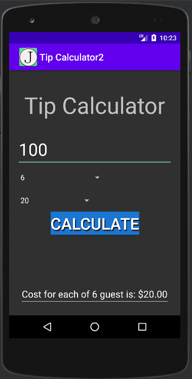

> **NOTE:** This README.md file should be placed at the **root of each of your main directory.**

# LIS 4331

## James Francois

### Assignment 2 Requirements:

*Sub-Heading:*

1. Screenshot of running application unpopulated
2. Screenshot of running application populated
3. Skillsets 1-3

#### README.md file should include the following items:

* Screenshot of running application unpopulated
* Screenshot of running application populated
* Skillsets 1-3

#### Assignment Screenshots:

| Screenshot of application populated | Screenshot of application unpopulated |
| -------------- | --------------|
|  |  |

| Screenshots of Skillset 1 | Screenshots of Skillset 2 |
| -------------- | --------------|
|  |  |

| Screenshot of Skillset 3| 
| -------------- |
|  |

#### Tutorial Links:

*Bitbucket Tutorial - Station Locations:*
[A1 Bitbucket Station Locations Tutorial Link](https://bitbucket.org/username/bitbucketstationlocations/ "Bitbucket Station Locations")

*Tutorial: Request to update a teammate's repository:*
[A1 My Team Quotes Tutorial Link](https://bitbucket.org/username/myteamquotes/ "My Team Quotes Tutorial")