> **NOTE:** This README.md file should be placed at the **root of each of your main directory.**

# LIS 4331

## James Francois

### Assignment 3 Requirements:

1. Course title, your name, assignment requirements, as per A1; 
2. Screenshot of running applications splash screen;
3. Screenshot of running applications unpopulated user interface; 
4. Screenshot of running applications toast notification;
5. Screenshot of running applications converted currency user interface;
6. Screenshot of Skillsets 4-6; 

#### README.md file should include the following items:

* Course title, your name, assignment requirements, as per A1; 
* Screenshot of running applications splash screen;
* Screenshot of running applications unpopulated user interface; 
* Screenshot of running applications toast notification;
* Screenshot of running applications converted currency user interface;
* Screenshot of Skillsets 4-6;

#### Assignment Screenshots:

| Screenshot of running applications splash screen | Screenshot of application unpopulated |
| -------------- | --------------|
| 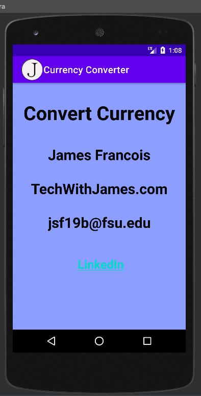 | 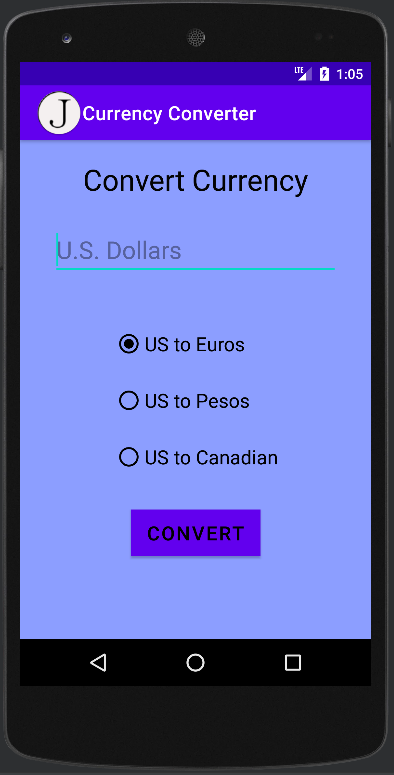 |

| Screenshot of running applications toast notification | Screenshot of running applications converted currency user interface |
| -------------- | --------------|
| 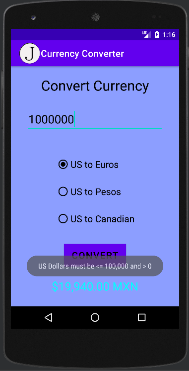 | 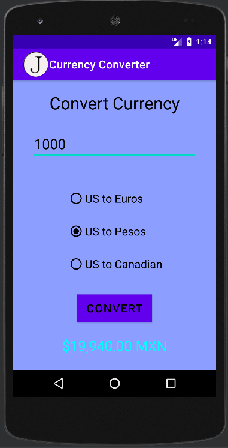 |

| Screenshots of Skillset 4 | Screenshots of Skillset 5 |
| -------------- | --------------|
| 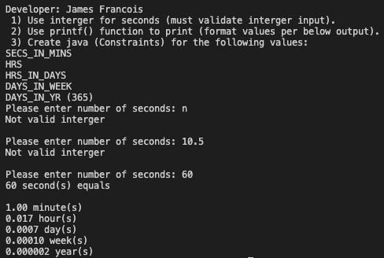 |  |

| Screenshots of Skillset 6.1 | Screenshots of Skillset 6.2 |
| -------------- | --------------|
| 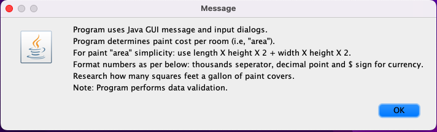 | 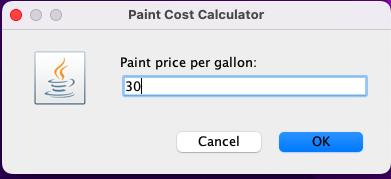 |

| Screenshots of Skillset 6.3 | Screenshots of Skillset 6.4 |
| -------------- | --------------|
| 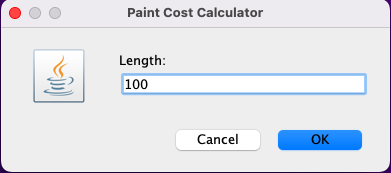 | 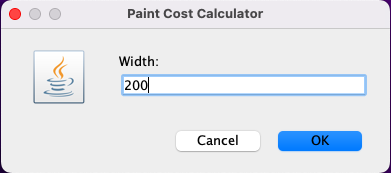 |

| Screenshots of Skillset 6.5 | Screenshots of Skillset 6.6 | 
| -------------- | -------------- | 
| 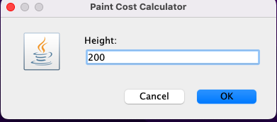 | 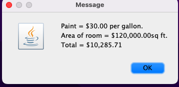 |  

#### Tutorial Links:

*Bitbucket Tutorial - Station Locations:*
[A1 Bitbucket Station Locations Tutorial Link](https://bitbucket.org/username/bitbucketstationlocations/ "Bitbucket Station Locations")

*Tutorial: Request to update a teammate's repository:*
[A1 My Team Quotes Tutorial Link](https://bitbucket.org/username/myteamquotes/ "My Team Quotes Tutorial")