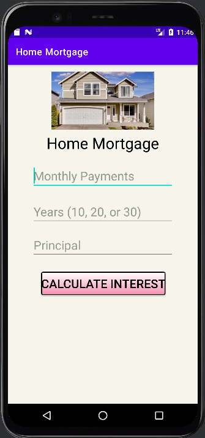
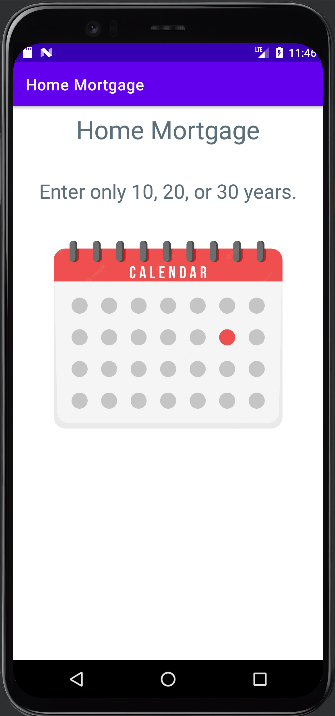
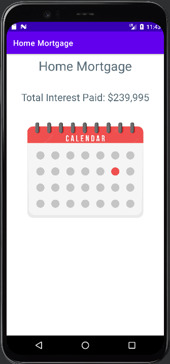
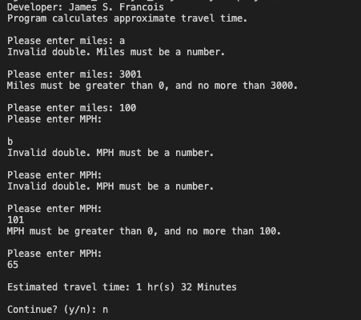
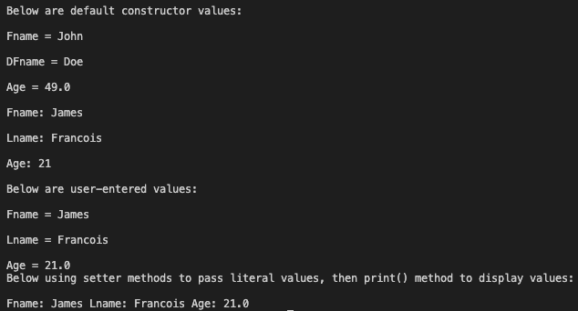
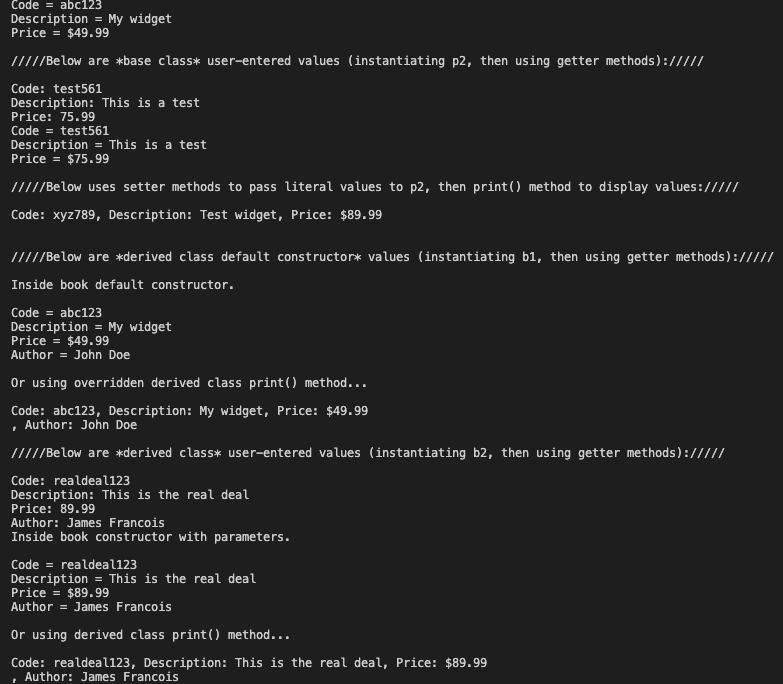

# LIS 4381 

## James Francois

### Assignment 4 Requirements:

*Sub-Heading:*

1. Course title, your name, assignment requirements, as per A1
2. Screenshot of running applications splash screen 
3. Screenshot of running applications invalid screen (with appropriate image)
4. Screenshots of running applications valid screen (with appropriate image)
5. Skillsets 10-12

#### README.md file should include the following items:

* Course title, your name, assignment requirements, as per A1
* Screenshot of running applications splash screen 
* Screenshot of running applications invalid screen (with appropriate image)
* Screenshots of running applications valid screen (with appropriate image)
* Skillsets 10-12

#### Assignment Screenshots:

| Screenshot of running applications splash screen | Screenshot of application unpopulated |
| -------------- | --------------|
|  |  |

| Screenshot of running applications invalid screen| Screenshots of running applications valid screen |
| -------------- | --------------|
|  |  |

#### Skillset Screenshots:

| Screenshot of Skillset 10 | Screenshot of Skillset 11 |
| -------------- | --------------|
|  |  |

| Screenshot of Skillset 12 |
| -------------- |
|  |

#### Tutorial Links:

*Bitbucket Tutorial - Station Locations:*
[A1 Bitbucket Station Locations Tutorial Link](https://bitbucket.org/username/bitbucketstationlocations/ "Bitbucket Station Locations")

*Tutorial: Request to update a teammate's repository:*
[A1 My Team Quotes Tutorial Link](https://bitbucket.org/username/myteamquotes/ "My Team Quotes Tutorial")