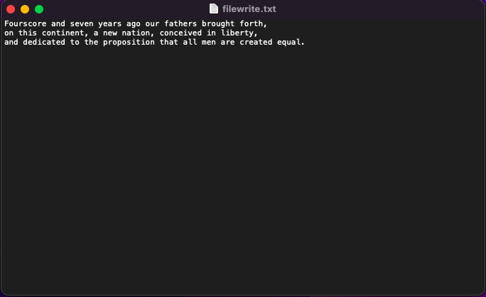
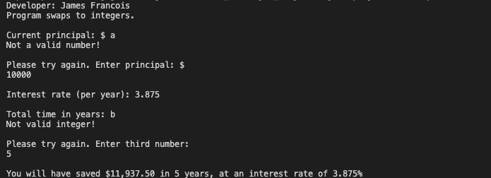
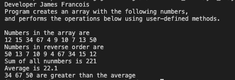

# LIS 4331 

## James Francois

### Assignment 5 Requirements:

*Sub-Heading:*

1. Course title, your name, assignment requirements, as per A1; 
2. Screenshot of running applications main screen (list of articles (activity_items.xml)); 
3. Screenshot of running applications individual article (activity_item.xml); 
4. Screenshots of running applications default browser (article link); 
5. Skillsets 13-15

#### README.md file should include the following items:

* Course title, your name, assignment requirements, as per A1; 
* Screenshot of running applications main screen (list of articles (activity_items.xml)); 
* Screenshot of running applications individual article (activity_item.xml); 
* Screenshots of running applications default browser (article link); 
* Skillset 13-15

#### Assignment Screenshots:

| Screenshot of running applications splash screen | Screenshot of application Main Page |
| -------------- | --------------|
|  |  |

| Screenshot of Indivdual Page| Screenshots of Article Page |
| -------------- | --------------|
|  |  |

#### Skillset Screenshots:

| Screenshot of Skillset 13 |
| -------------- |
|  |

| Screenshot of Skillset 14 |
| -------------- |
|  |

| Screenshot of Skillset 15 |
| -------------- |
|  |