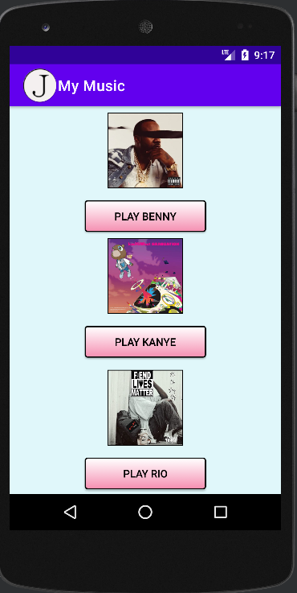
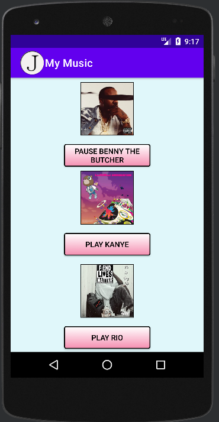

# LIS 4331

## James Francois

### Project 1 Requirements:

*Sub-Heading:*

1. Course title, your name, assignment requirements, as per A1
2. Screenshot of running applications splash screen 
3. Screenshot of running applications follow-up screen (with images and buttons)
4. Screenshots of running applications play and pause user interfaces (with images and buttons)
5. Skillsets 7-9

#### README.md file should include the following items:

* Course title, your name, assignment requirements, as per A1 
* Screenshot of running applications splash screen
* Screenshot of running applications follow-up screen (with images and buttons)
* Screenshots of running applications play and pause user interfaces (with images and buttons)
* Skillsets 7-9

#### Assignment Screenshots:

| Screenshot of running applications splash screen | Screenshot of home screen |
| -------------- | --------------|
|  |  |

| Screenshot of running applications playing screen | Screenshot of application paused screen |
| -------------- | --------------|
|  |  |

| Screenshot of Skillset 7 | Screenshot of Skillset 8.1|
| -------------- | --------------|
|  |  |

| Screenshot of Skillset 8.2 | Screenshot of Skillset 9.1 |
| -------------- | --------------|
|  |  |

| Screenshot of Skillset 9.2 | Screenshot of Skillset 9.3 |
| -------------- | --------------|
|  |  |