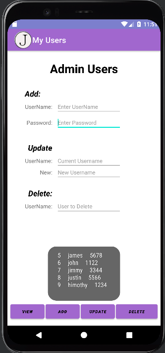

# LIS 4331 

## James Francois

### Project 2 Requirements:

*Sub-Heading:*

1. Course title, your name, assignment requirements, as per A1; 
2. Screenshot of Adding a User
3. Screenshot of Updating a User
4. Screenshot of Viewing a User
5. Screenshot of Deleting a user

#### README.md file should include the following items:

* Course title, your name, assignment requirements, as per A1; 
* Screenshot of Adding a User
* Screenshot of Updating a User
* Screenshot of Viewing a User
* Screenshot of Deleting a user

#### Assignment Screenshots:

| Screenshot of running applications splash screen | Screenshot of Adding a User |
| -------------- | --------------|
|  |  |

| Screenshot of Updating a User| Screenshots of Viewing a User|
| -------------- | --------------|
|  |  |

| Screenshot of Deleting a user|
| -------------- |
|  |